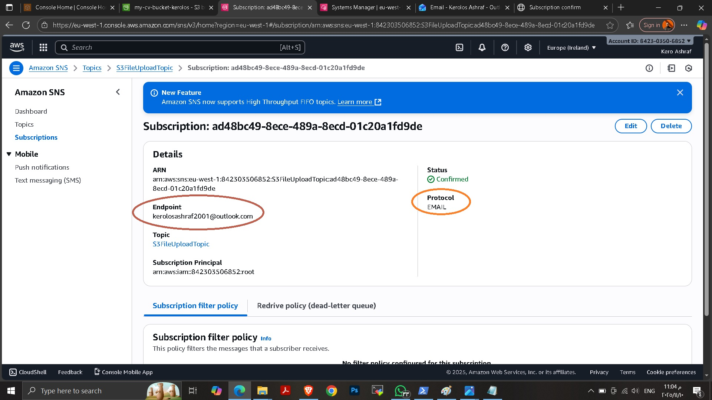
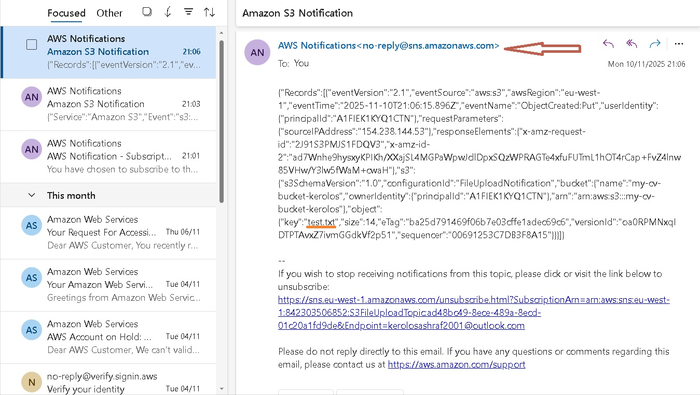
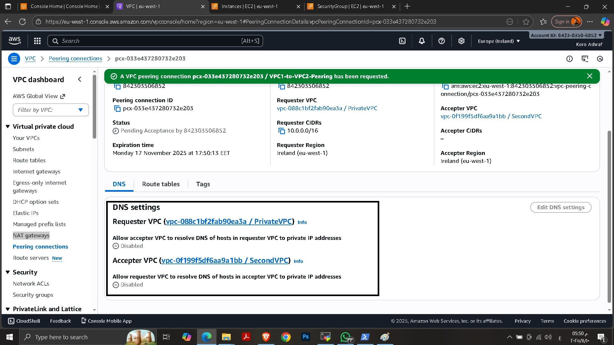
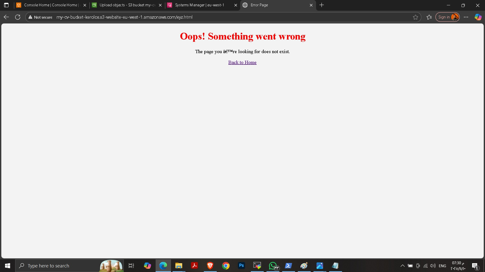
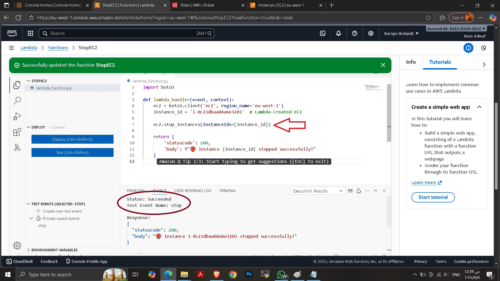
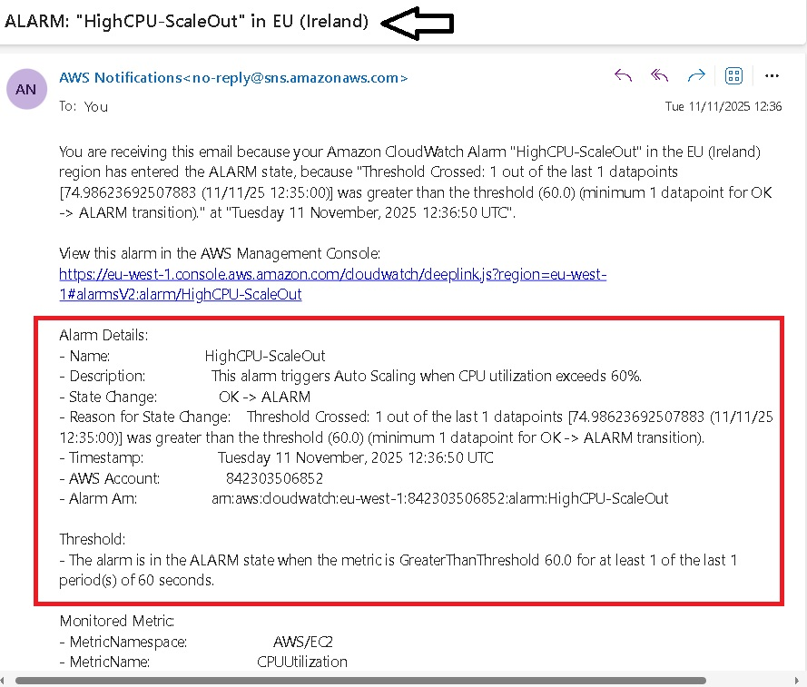
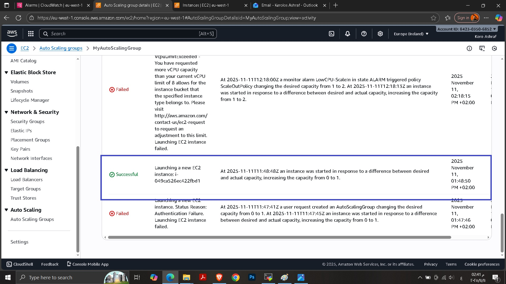
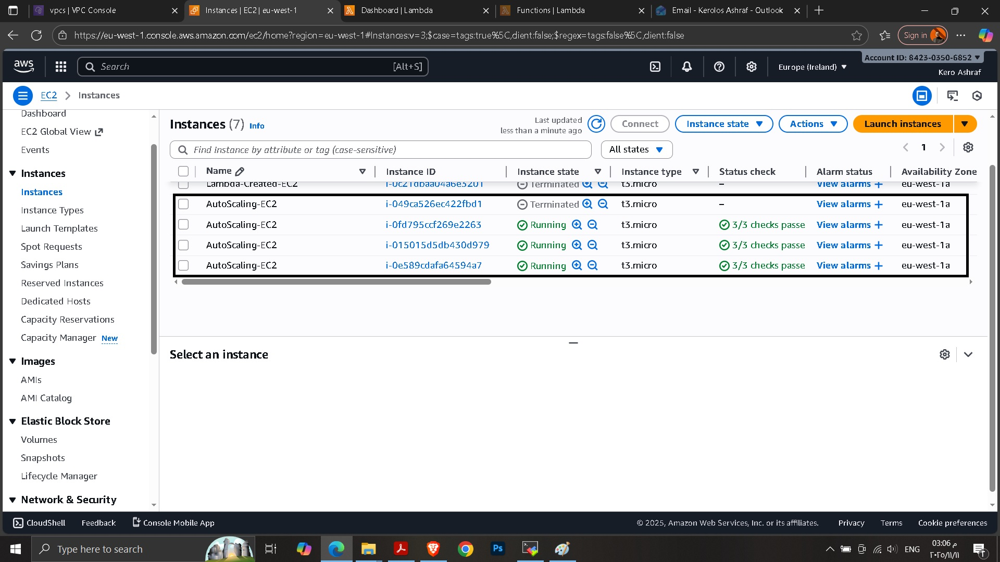

# AWS Auto Scaling with CloudWatch Alarms

This project demonstrates how to automatically scale EC2 instances using
AWS Auto Scaling Groups integrated with CloudWatch Alarms based on CPU utilization.

> Note:
> All AWS resources were intentionally deleted after completing the project
> to avoid unnecessary AWS charges. Screenshots are provided as proof of
> implementation and testing.

---

## Project Architecture
- EC2 Launch Template
- Auto Scaling Group (Min: 1, Max: 3)
- CloudWatch Alarms
  - High CPU → Scale Out
  - Low CPU → Scale In
- SNS Notifications

---

## Scaling Logic

| Alarm Name | Condition | Action |
|-----------|----------|--------|
| HighCPU-ScaleOut | CPUUtilization > 60% | Add EC2 Instance |
| LowCPU-ScaleIn | CPUUtilization < 30% | Remove EC2 Instance |

---

## Testing
CPU load was generated manually on EC2 instances using the Linux `stress` tool
to validate scaling behavior.

---

## Proof of Work
All screenshots showing:
- Auto Scaling Group creation
- CloudWatch alarm states
- Scale-out and scale-in events  
are available in the `screenshots/` directory.

---

## Cost Management
All AWS resources were terminated after testing to prevent unexpected billing.

---
## 📸 Project Screenshots

---

---

---

---
## Author
Kerolos Ashraf
